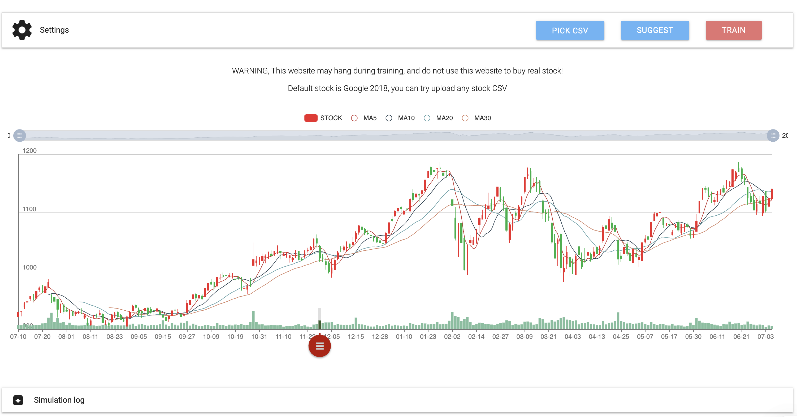
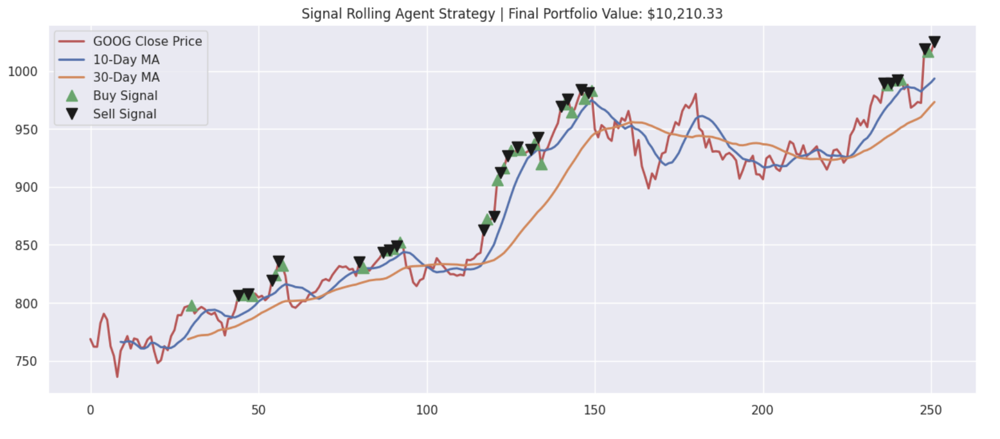
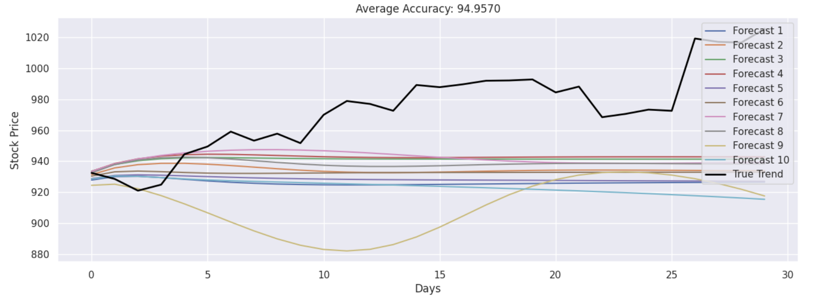

# **StockPred**

    

## Overview
StockPred involves an LSTM RNN and a Simple Signal Rolling Agent to perform stock forecasting on various stocks.

## Frontend
I then coded the frontend for the LSTM RNN and Simple Signal Rolling Agent inside Tensorflow JS, and you can try it at [the StockPredict website](https://stockpred9.netlify.app/). In the application, you can upload an historical CSV and customize model parameters to predict forecasts. The web application allows users to see a live loss function with real and predicted histograms, a simulation of buying and selling actions, and buy/sell indicators at various points along the graph.

## Results

### Agent Results

**This agent is only able to buy or sell 1 unit per transaction.**

Signal rolling agent

### Model Results

For train-test split: 

1. Train dataset was derived from the starting timestamp until the last 30 days
2. Test dataset was derived from the last 30 days until the end of the dataset

The model did forecasting based on last 30 days, and this experiment was repeated 10 times. This can be increased locally, and hyperparameter tuning is also recommended.

LSTM, accuracy 95.693%, time taken for 1 epoch 01:09

## Notes 

If running the LSTM or Signal Rolling Agent, make sure to clone the repository and also update the CSV that you want to use for df accordingly. I worked in isolated Jupyter notebooks so I didn't upload the entire dataset folder, but make sure to include the complete file path when uploading the CSV from the dataset folder. 
